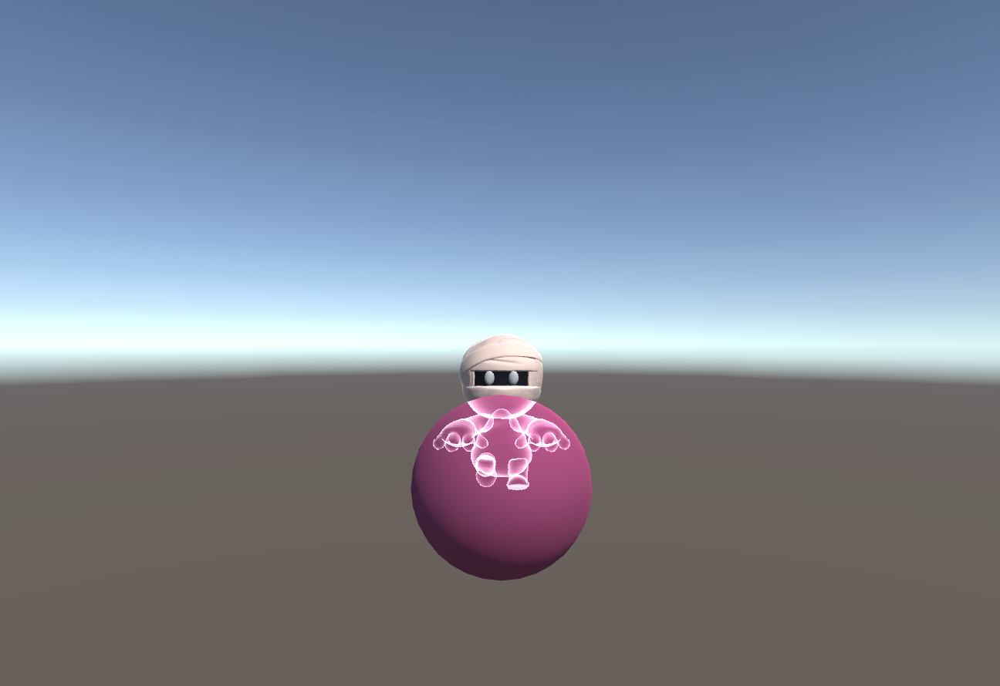

## ShaderForUnity
### 介绍
本仓库旨在学习unity shader的基础以及各种常见的shader效果
> Unity 2018.1.2f1 
> macOS 10.13.6
### 目录
#### Assets/Basic
Unity Shader的理论知识
* 1-Base
	* 最简单的Shader
* 2-Light
	* 漫反射兰伯特模型
	* 漫反射半兰伯特模型
	* 高光反射模型
	* 高光放射Blinn模型
* 3-Texture
	* 基础纹理
	* 切线空间下的凹凸映射

#### Assets/XRay
游戏中常见的人物被障碍物阻挡后的X光效果
* 方式1：XRay-UseCombine
	* 合并mesh，并添加额外材质的方式实现
* 方式2：XRay-UseTwoPass
	* shader中使用两个pass

#### Assets/Dissolve
TODO：人物死亡后的溶解效果

#### Assets/Blur
TODO：常见的几种模糊效果

#### Assets/Mirror
TODO：镜子效果

#### Assets/GhostShader
TODO：人物移动时的残影效果